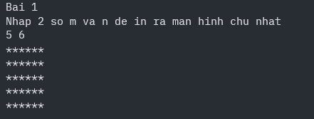
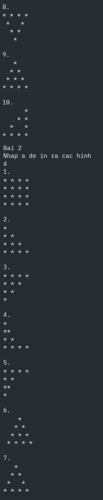

**Lướt xuống để xem code**



<details>
<summary><strong>(Click to expand)</strong></summary>

```python
print("Bai 1")
print("Nhap 2 so m va n de in ra man hinh chu nhat")
m, n = map(int, input().split())  # m is h, n is w
for i in range(m):
    print("*" * n)


print()
print("Bai 2")
print("Nhap a de in ra cac hinh")

a = int(input())


def print_dot(x):
    print("1.")
    for i in range(x):
        print("* " * x)
    print()
    print("2.")
    for j in range(1, x + 1):
        print("* " * j)
    print()
    print("3.")
    for h in range(x, 0, -1):  # tam giac nguoc, can di qua so 0 idk why cuz its index
        print("* " * h)
    print()
    print("4.")
    for o in range(1, x + 1):
        # print("*"*(o-1))
        if o == 1:
            print("*")
        elif o == x:
            print("* " * x)
        else:
            print("*" + " " * (o - 2) + "*")

    print()
    print("5.")
    for o in range(x, 0, -1):  # giong 4. nhma thay range nguoc lai
        if o == 1:
            print("*")
        elif o == x:
            print("* " * x)
        else:
            print("*" + " " * (o - 2) + "*")

    print()
    print("6.")
    for i in range(x):
        print(
            " " * (x - i) + "* " * (i + 1)
        )  # tinh khoang spacc ben trai sau do print ra "* "
    print()
    print("7.")
    for i in range(1, x + 1):
        print(
            " " * (x - i), end=""
        )  # them space de cach khoang trang cho dong dau tien
        if i == 1:
            # Đỉnh tháp: chỉ 1 sao
            print("*")

        elif i == x:
            print("* " * x)
        else:
            # Phần thân rỗng: Sao + Khoảng trống + Sao
            # Công thức khoảng trống ở giữa: 2*i - 3
            print("*" + " " * (2 * i - 3) + "*")
    print()
    print("8.")
    for i in range(x, 0, -1):
        print(" " * (x - i), end="")
        if i == 1:
            print("*")
        elif i == x:
            print("* " * x)
        else:
            print("*" + " " * (2 * i - 3) + "*")
    print()
    print("9.")
    for j in range(1, x + 1):
        print(" " * (x - j) + "* " * j)  # ap dung hinh 3 va 6
    print()
    print("10.")
    for j in range(1, x + 1):
        if j == 1:
            print("  " * (x - j) + "*")
        elif j == x:
            print("* " * x)
        else:
            print("  " * (x - j) + "*" + " " * (2 * j - 3) + "*")
        # print(" " * (x - j)+ "*" * j) #ap dung hinh 3 va 6


print_dot(a)

print()
print("Bai 3")
print("Nhap x de in ra cac hinh")
x = int(input())


def draw_dot_number(n):
    print("1. ")
    for i in range(1, n + 1):
        for j in range(1, i + 1):
            print(j, end="")
        print()
    print()
    print("2. ")
    for i in range(n, 0, -1):
        for j in range(1, i + 1):
            print(j, end="")
        print()
    print("3. ")
    # print("6.")
    #     for i in range(x):
    #         print(
    #             " " * (x - i) + "* " * (i + 1)
    #         )  # tinh khoang spacc ben trai sau do print ra "* "
    #     print()
    for i in range(1, n + 1):
        print(" " * (n - i), end=" ")
        print((str(i) + " ") * i)
    print()
    print("4. ")
    for i in range(1, n + 1):
        print("  " * (n - i), end="")
        for j in range(1, i + 1):
            print(j, end=" ")
        for k in range(i - 1, 0, -1):
            print(k, end=" ")
        print()


draw_dot_number(x)

</details>


